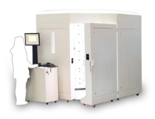

**Entirely Personal: A Deep Dive into 3D Scanning, Remeshing, and Knitting**

**Introduction**

The design world is vast and ever-evolving, with new technologies and methodologies constantly emerging. In this journal, we delve into a specific project that seeks to explore and understand some of these cutting-edge techniques. This project, while multifaceted, is organized into three distinct work packages, each with its unique focus and objectives.

The **first package** is dedicated to the technological assessment at AMFI. Here, the goal is to evaluate and contrast the two available technologies to pinpoint the optimal scan settings that would yield the best results. This phase is crucial as it sets the foundation for the subsequent stages, ensuring that the data acquired is of the highest quality.

Moving on, the **second package** delves into the world of remeshing. This phase is all about exploring various approaches to remeshing strategies. Remeshing, in the context of this project, is pivotal as it determines how the scanned data is processed and prepared for the final phase.

The **third and final package** bridges the gap between design and production. It revolves around the sampling and iteration process, specifically between the Rhino/Grasshopper environment and the native 3D knitting software, namely Stoll’s M1plus and Shima Seiki’s Apex. The design truly comes to life in this phase, transforming from digital data into tangible knitted structures.

In the pages of this journal I will keep sum of all the experiences done during this research.

**May 12, 2022 \_** 3D Scan Technologies: Initial Assessment

- Began assessment of various 3D scan technologies.
- Initial focus on Scanlounge V2.5 by Scanlogics, using photogrammetry technology.
- Noted high-resolution outputs and clean data, but lack of raw data (point clouds) is a concern.

Considerations:

- The Scanlounge V2.5 shows immense promise due to its high-resolution and clean output. The technology seems to be advanced, but the lack of raw data is a significant limitation. This could affect the flexibility and control we have over the data processing stage.

Next Steps:

- Investigate the possibilities of using an iPad for scanning.
- Compare TrueDepth and Lidar applications on the iPad.

Technology: Photogrammetry

Max. resolution: 0.1 mm

244 cameras of 8 MP each

8 projectors with light textures to help photogrammetry

Price:  $ 60,500

Source: 

<https://www.aniwaa.com/product/3d-scanners/scanologics-scanlounge/>

<https://www.scanologics.com/>

-----
**May 16, 2022 \_** 3D Scan Technologies: iPad Scanning

- Conducted experiments with iPad scanning, achieving a max resolution of 0.5mm-1mm.
- Observed that TrueDepth and Lidar technologies are time-consuming and sensitive to micro-movements.
- Lidar is better for environments, TrueDepth has a denser grid that works better with smaller items.

Considerations:

- The iPad, being a more accessible and cost-effective tool, presents a compelling case. However, the time it takes to capture a scan and the sensitivity to micro-movements could lead to less reliable data. The resolution is also notably lower than the Scanlounge V2.5.

Next Steps:

- Analyze and compare the results of Scanlogics' photogrammetry and iPad scanning.
- Decide on the technology to proceed with for further experiments.

PRO:

- A cheap tool to realize good outputs.
- many app and software possibilities.
- availability of lot of outputs and raw data
- enough good resolution for body scan purpose.

CONS:

- need to post-produce mesh.
- True depth and Lidar technologies needs more time to get a scan, allowing mistakes due micro-movements.

Source: <https://www.researchgate.net/publication/350729997_Comparison_of_iPad_ProR's_LiDAR_and_TrueDepth_Capabilities_with_an_Industrial_3D_Scanning_Solution>

**May 18, 2022 \_** 3D Scan Technologies: Comparison

- After comparing the available technologies at Amfi,  we decided to use photogrammetry with the Scanalounge
- we took several elbows scan to use as topology test for the exploration

**Jun 12, 2022 \_** Remeshing: Initial Approach

- Began work on remeshing the output from the scanner to create knitting instructions.
- Initial attempts with Anemone in Rhinoceros Grasshopper, based on Carnegie Mellon's Textile Lab research.
- Faced challenges in generating reliable knitting instructions due to complex topology.

Considerations:

- The remeshing process is proving to be a significant challenge. The initial mesh is complex, and translating this into knitting instructions is not straightforward. The Anemone plugin in Grasshopper is powerful but may require a more sophisticated approach to handle the complexity of garment shapes.

Next Steps:

- Explore alternative remeshing methods, including circle packing and Cockatoo plugin.
-----
Journal Entry: August 10, 2022

3\.2 Remeshing: Circle Packing and Cockatoo

- Conducted experiments with circle packing algorithm; faced issues with data loss and ordering.
- Started working with Cockatoo, a Grasshopper plugin; promising initial results.
- Cockatoo appears to be the most reliable approach for our purposes.

Considerations:

- Circle packing was an interesting approach, but the randomness and data loss are significant issues. Cockatoo, on the other hand, seems to offer a more structured and reliable process. It’s encouraging to see a potential path forward with this plugin.

Next Steps:

- Conduct extensive tests with Cockatoo.
- Begin integration with knitting software such as Shima Seiki's Apex or Stoll's M1plus.
-----
Journal Entry: September 5, 2022

3\.3 Sampling and Measurements: Initial Tests

- Conducted detailed analysis of different samples knitted using our modified version of Cockatoo.
- Observed the need for post-production process standardization across all samples.
- Initial tests with “Elbow” sample highlighted issues in bitmap generation and manual corrections needed.

Considerations:

- The transition from digital to physical is revealing intricate nuances. The “Elbow” sample test was a learning experience; the bitmap errors were unexpected and required manual intervention. Standardizing the post-production process is emerging as a critical need.

Next Steps:

- Refine Cockatoo script for more accurate results in goring and increasing/decreasing.
- Conduct tests with larger samples, such as a full sleeve or torso.
-----
Journal Entry: September 25, 2022

3\.3 Sampling and Measurements: Large Scale Tests and Challenges

- Ran tests on an entire elbow sleeve and a front panel of a sleeveless sweater.
- Encountered unpredictability in 2D shape and 3D topology when scaling up.
- Noted the need for a system inside the script that maintains the general shape of the knitted piece.

Considerations:

- Scaling up to larger samples, like a full sleeve or torso, has introduced new complexities. The unpredictability in 2D shape and 3D topology is a significant concern. It’s becoming clear that our algorithm needs to be more sophisticated to handle these larger, more complex shapes while maintaining the integrity of the design.

Next Steps:

- Develop a user interface within Rhino/Grasshopper for operator input.
- Explore methods for automatic bitmap production for specific machines.
- Consider testing with different stitch types beyond Single Jersey.

**Entry 2: June 23, 2022 - Expanding 3D Scan Assessment**

June 23, 2022, found me further immersed in the exploration of 3D scan technologies. The assessment of the Scanlounge V2.5 continued, revealing its ability to yield clean, high-resolution outputs. Yet, challenges associated with data handling and the absence of raw data persisted, prompting me to explore alternative avenues.

The enigmatic potential of iPad technologies continued to captivate my attention. Diving into the intricacies of the Lidar and TrueDepth applications, I deciphered their distinct capabilities and applications. As I journeyed through this month, my exploration expanded beyond the surface, leading me to appreciate the intricate dance between technology and research objectives.

**Entry 3: July 12, 2022 - Navigating Remeshing Approaches**

July 12, 2022, marked my transition into the fascinating realm of remeshing approaches. Armed with insights from Carnegie Mellon's Textile Lab, I delved into the intricate world of transforming scanned data into knittable instructions. The Grasshopper platform, celebrated for its user-friendly coding approach and CAD software compatibility, beckoned as a suitable environment.

Within this landscape, I embarked on an exploration of three distinctive remeshing methodologies: iterative remeshing, circle packing, and the promising Cockatoo plugin by Max Eschenbach. Iterative remeshing unveiled its potential in dividing mesh sections, while circle packing intrigued me with its algorithmic elegance. The Cockatoo plugin, rooted in extensive research, emerged as a beacon of promise. These explorations set the stage for the depth of analysis and refinement to follow.

**Entry 4: August 7, 2022 - Refining Remeshing Techniques**

August 7, 2022, saw my focus on remeshing techniques intensify. I embarked on a journey of refining and fine-tuning the methodologies explored. Iterative remeshing, executed with the Anemone Grasshopper plugin, presented a spectrum of challenges, particularly concerning the translation of increasing and decreasing knitting instructions. Meanwhile, circle packing's potential in generating intricate row structures held me in awe, albeit with the complexity of mesh face ordering.

As my exploration matured, the Cockatoo plugin emerged as a robust solution. Its capacity to remesh geometries into a knittable topology, coupled with the conversion of underlying graphs into bitmap images, proved captivating. August marked the transition from experimental exploration to pragmatic implementation, paving the way for the convergence of theory and practice.

**Entry 5: September 18, 2022 - Implementing Cockatoo in Practice**

September 18, 2022, witnessed the culmination of my theoretical inquiries as I embraced practical implementation. The Cockatoo plugin, standing as the beacon of remeshing solutions, took center stage. With the knowledge and insights gleaned from iterative remeshing and circle packing, I harnessed Cockatoo's prowess to transform scanned data into knittable instructions.

The remeshing process, guided by Cockatoo's time-field simulation and graph-based approach, unfolded seamlessly. Rigorous testing and analysis affirmed its reliability, providing a deeper understanding of its successful implementation. This phase marked the harmonious integration of digital design and tangible knitting, symbolizing the culmination of a meticulous journey.

**Entry 6: October 4, 2022 - Bridging Digital and Physical Realms**

October 4, 2022, heralded the transition into a new phase of exploration: Sampling and Measurements. Armed with refined remeshing techniques, I ventured into the realm of practical application. My goal was to bridge the gap between the digital realm of design and the tangible world of knitting.

In this phase, I knitted various samples using a Grasshopper recipe rooted in the enhanced Cockatoo extension. Through meticulous experimentation, I sought to comprehend the nuances between digital design files and physical knit samples. This process involved fine-tuning parameters such as offset surfaces and triangular re-meshing to optimize remeshing algorithms.

Yarn density checks were meticulously conducted for each sample, enabling a comprehensive understanding of stitch dimensions. These samples, executed in Single Jersey using merino wool, provided a tangible connection between digital design representations and physical knit outcomes.

**Entry 7: November 15, 2022 - Elbow Sample: From Digital to Knit**

November 15, 2022, marked a significant milestone as I applied the insights gained from earlier explorations to knit a specific sample. Leveraging a 3D model of an elbow captured through the Scanlounge V2.5, I set out to produce a knitted representation. Utilizing an 18-gauge Stoll ADF machine (18 needles/inch), I embarked on the journey of translating digital design into tangible fabric.

However, challenges surfaced during the translation process. The initial results within Cockatoo produced a bitmap riddled with errors that required manual intervention. As I grappled with these intricacies, I began to establish general rules that could be scripted back into Cockatoo for more precise results in goring and the complex realm of increasing and decreasing. This iterative process highlighted the complexities of translating intricate digital geometries into tangible knit instructions.

**Entry 8: December 23, 2022 - Head Sample: Navigating Gauge and Resolution**

December 23, 2022, ushered in a new challenge: the exploration of gauge and resolution. With a 3D model of a human head, I set out to knit a sample using a modified script to address double row issues. Utilizing a 9-needles/inch Stoll machine, the sample's execution presented both insights and challenges.

The lower gauge of 9 needles/inch, while impacting visible 3D topological emergence, significantly affected the 2D shape. Notably, the shape marks became more pronounced. This endeavor underscored the intricate relationship between gauge, resolution, and the final knitted outcome.

**Entry 9: January 14, 2023 - Advancing Techniques: Elbow\_plating Sample**

As the new year began on January 14, 2023, I turned my attention to advancing techniques. Building upon the insights gained, I refined the Cockatoo script to incorporate color variations. This innovation allowed for the assignment of different yarn carriers on distinct colors, enhancing the examination of short-rowing intricacies.

With this refined approach, I knitted the Elbow\_plating sample, pushing the boundaries of our research. The intricate plating technique, facilitated by script enhancements, offered a clearer understanding of short-rowing intricacies. This progression marked a significant step towards unraveling the complex relationship between digital design and physical knitting.

**Entry 10: February 28, 2023 - Complex Front Panel Exploration**

February 28, 2023, witnessed a foray into complexity with the exploration of a front body panel. Leveraging a 3D body scan, I embarked on creating a sleeveless sweater divided into front and back panels. However, this intricate endeavor presented unforeseen challenges, leading to unpredictable results in both 2D shape and 3D topology.

This endeavor reinforced the notion that translating complex shapes into accurate knitting instructions requires further refinement and sophistication. As I navigated this complexity, the project's scope expanded to address the intricate interplay between digital geometry, knitting instructions, and the nuances of physical execution.

